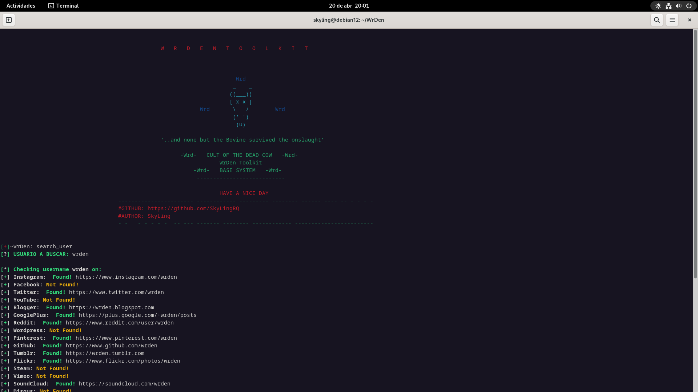

# INSTALACIÓN

```bash
git clone https://github.com/SkyLingRQ/WrDen
cd WrDen
chmod +x WrDen.py install.sh
sudo bash install.sh
sudo python3 -m pip install -r requirements.txt
```

# EJECUCIÓN

```bash
python3 WrDen.py
```


# MODULOS

 * phone_dox     :   Datos de un número telefónico
      
 * ip_hosts     :   Identificar la ip de un sitio web
   
 * ip_track        :   Datos de una dirección ip pública
   
 * scan_port     :   Escaneo total de puertos hacia una ip
   
 * fake_name      :   Generar Identidad Falsa
      
 * search_user    :   Realizar una busqueda de un username en distintas redes sociales
   
 * hash_encrypted   :   Hashear textos en variedades de tipos de hash. Se incluye encriptación por bcrypt

# OTRAS OPCIONES

* help   :  Mostrar menú de opciones. 
   
* exit  : salir del programa
   
* clear  :  Limpiar la pantalla
 


